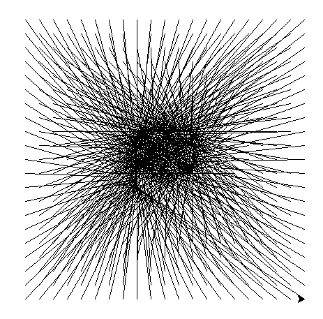

# Ulam spirals
[wikipedia ulam spiral]: https://en.wikipedia.org/wiki/Ulam_spiral
[jacob yatsko on ulam spirals]: https://youtu.be/inrYsAusfPg

In response on a video of [jacob yatsko on ulam spirals]. I made a program that walks along all the points of the spiral from wich the [ulam spiral][wikipedia ulam spiral] is created.

every point has as a number associated with it. for every point a line is drawn to the point that is associated with the square root of the number.  
for points where the square root is not an integer (eg sqrt(2) = 1.41421).
a number is chosen that is proportionally between the floor of the sqrt and the ceil of the sqrt. (eg sqrt(2) is 41.421% between point 1 and point 2)

To run this program, you need to have python 3 installed.
Execute the following command on a commandline.

$ `python ulam_spiral.py`
